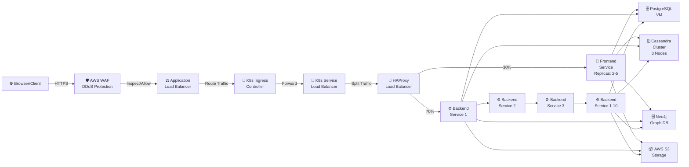
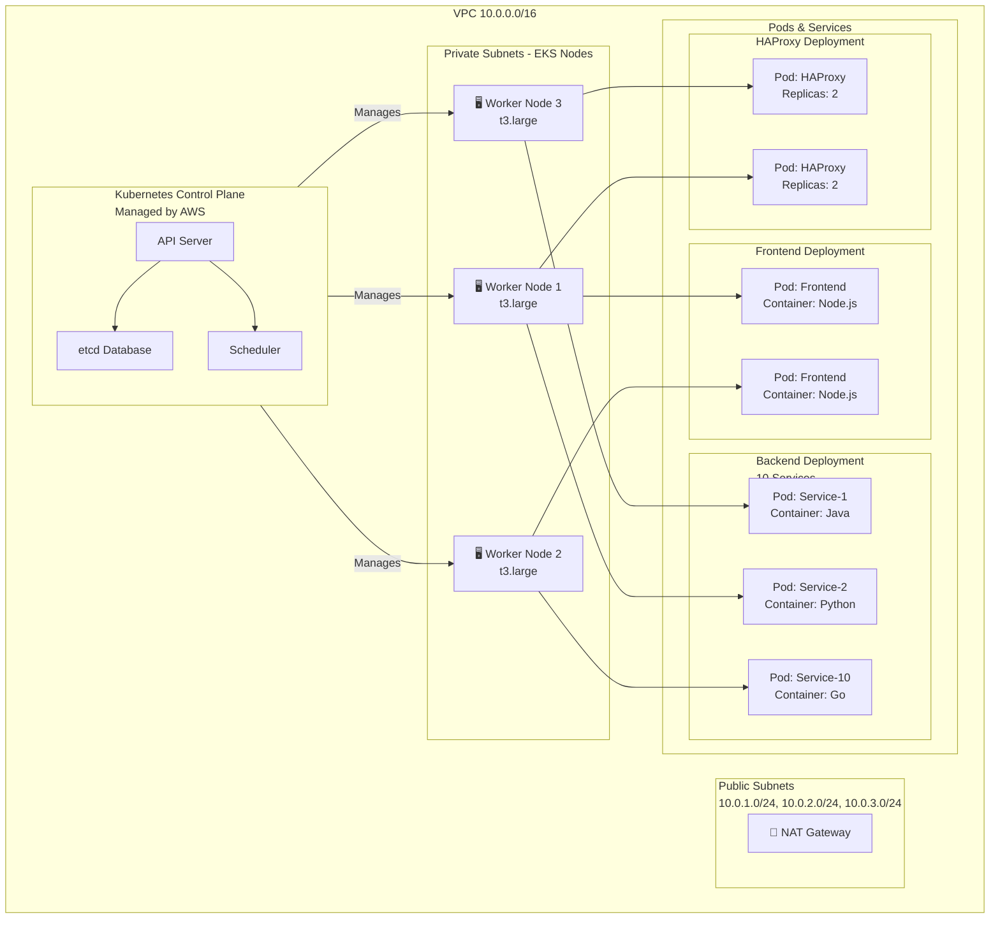
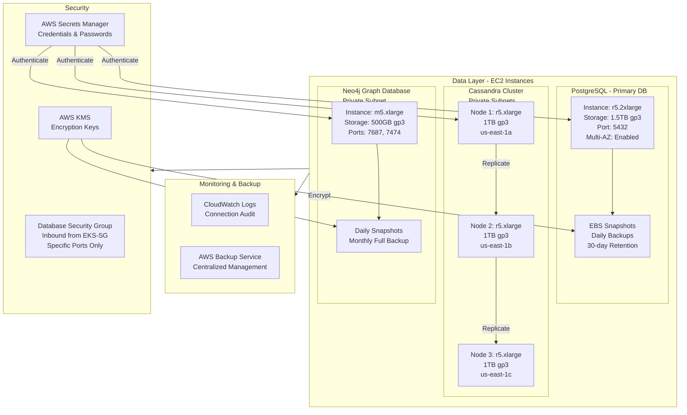
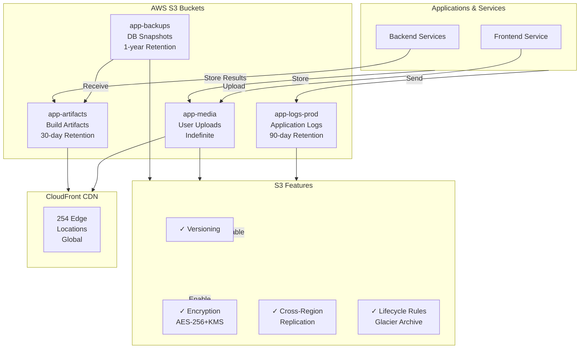
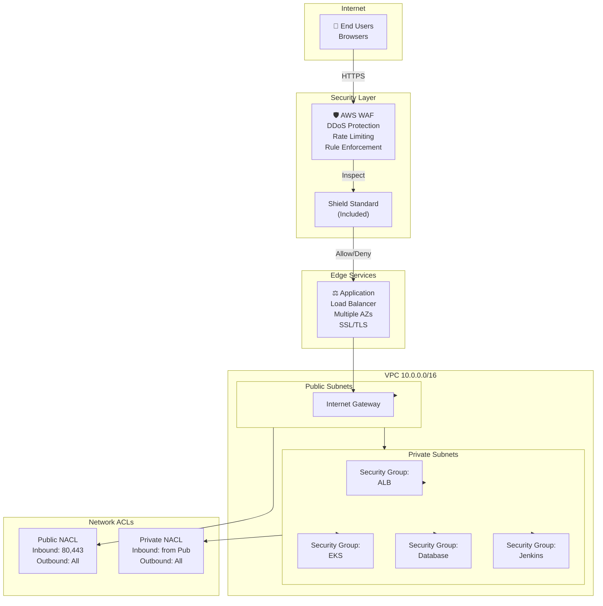
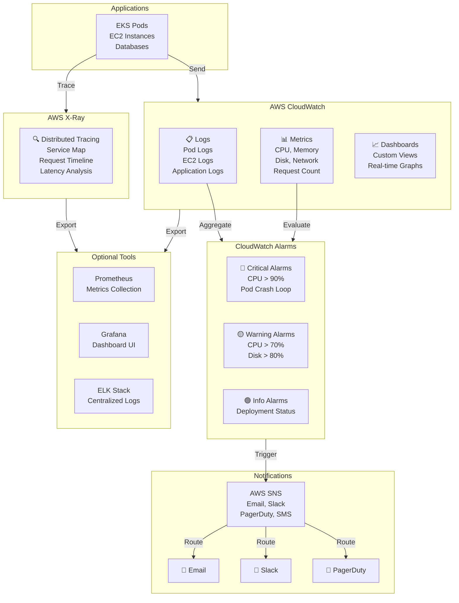
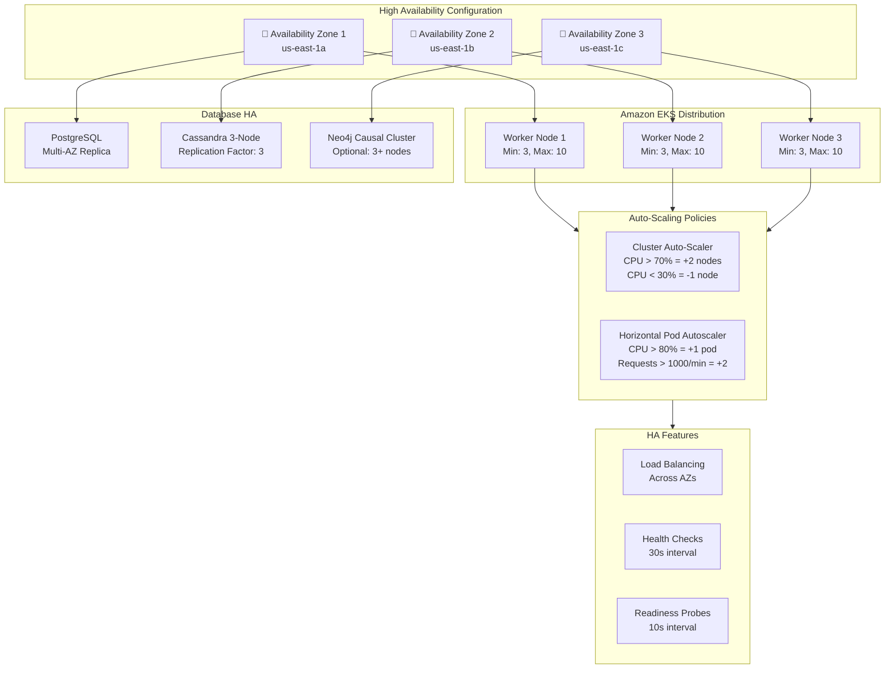
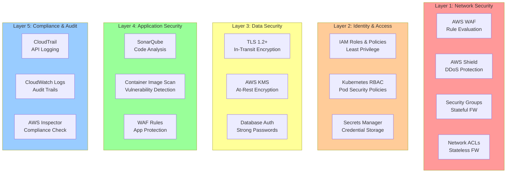
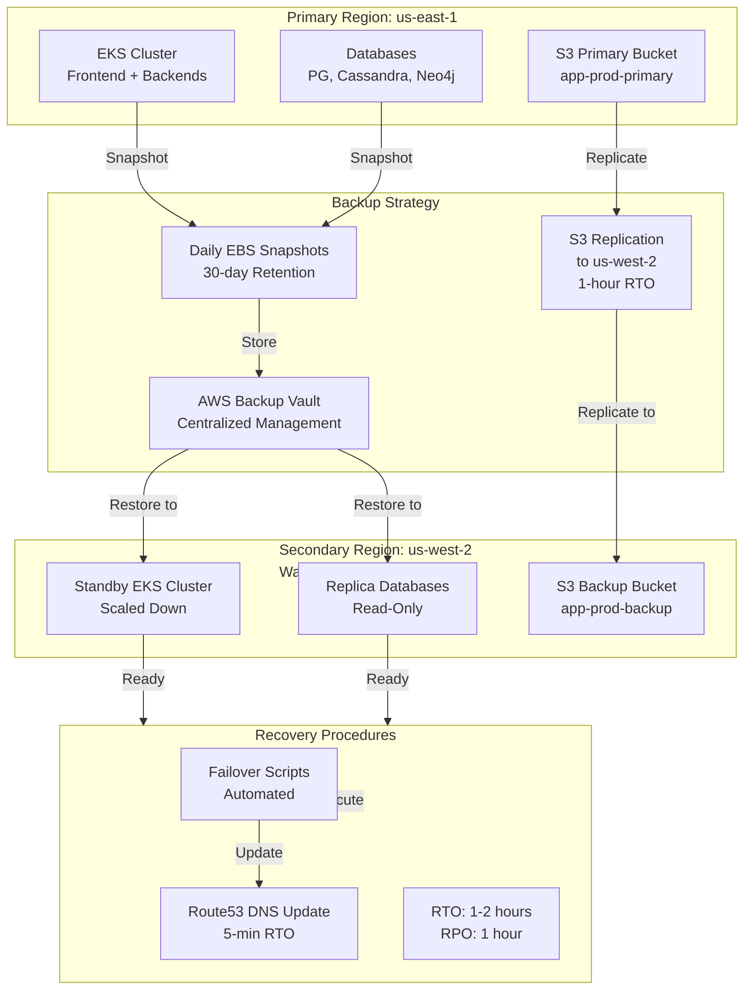

# AWS Architecture - Detailed Mermaid Diagrams

## 1. Request Flow Diagram

---

## 2. EKS Cluster Architecture

---

## 3. Data Layer Architecture

---

## 4. CI/CD Pipeline Flow

```mermaid
graph LR
    Git["📝 Git Repository<br/>GitHub/GitLab<br/>Webhook Trigger"]
    
    Jenkins["Jenkins Master<br/>t3.xlarge"]
    
    Build["🔨 Build Stage<br/>Maven/npm<br/>Compile & Test"]
    
    Test["🧪 Test Stage<br/>Unit Tests<br/>SonarQube<br/>SAST"]
    
    Container["📦 Container Stage<br/>Docker Build<br/>Image Scan<br/>Tag Image"]
    
    ECR["🐳 Amazon ECR<br/>Registry<br/>Image Push"]
    
    Deploy["🚀 Deploy Stage<br/>Helm Chart<br/>kubectl Apply<br/>Rollout"]
    
    EKS["☸️ Amazon EKS<br/>Kubernetes Cluster"]
    
    Verify["✅ Verification<br/>Smoke Tests<br/>Health Check"]
    
    Notify["📢 Notification<br/>Slack/Email<br/>Success/Failure"]
    
    Git -->|Webhook| Jenkins
    Jenkins --> Build
    Build --> Test
    Test --> Container
    Container --> ECR
    ECR --> Deploy
    Deploy --> EKS
    EKS --> Verify
    Verify --> Notify
```

---

## 5. Storage & Backup Architecture

---

## 6. Network Security Architecture

---

## 7. Monitoring & Observability Stack

---

## 8. High Availability & Auto-Scaling

---

## 9. Security Layers

---

## 10. Disaster Recovery Architecture

---

## Component Specifications Summary

| Component | Type | Quantity | Size/Spec | Cost/Month |
|---|---|---|---|---|
| **Compute** | | | | |
| EKS Nodes | t3.large | 3-10 | 2vCPU, 8GB RAM | ~$500-1500 |
| Jenkins Master | t3.xlarge | 1 | 4vCPU, 16GB RAM | ~$250 |
| **Databases** | | | | |
| PostgreSQL | r5.2xlarge | 1 | 8vCPU, 64GB RAM | ~$3000 |
| Cassandra | r5.xlarge | 3 | 4vCPU, 32GB RAM each | ~$6000 |
| Neo4j | m5.xlarge | 1 | 4vCPU, 16GB RAM | ~$800 |
| **Storage** | | | | |
| EBS Volumes | gp3 | 5+ | 500GB-1.5TB | ~$200-400 |
| S3 Storage | Standard | 4 buckets | 10TB total | ~$250 |
| S3 Data Transfer | | | | ~$500-1000 |
| **Network** | | | | |
| ALB | Network LB | 1 | Multi-AZ | ~$200 |
| NAT Gateway | NAT | 3 | Per AZ | ~$150 |
| CloudFront | CDN | 1 | 254 locations | ~$100-500 |
| **Monitoring** | | | | |
| CloudWatch | Logs/Metrics | | | ~$100-300 |
| **Total Estimated** | | | | **$12,000-15,000/month** |

---

## Getting Started Checklist

- [ ] AWS Account with appropriate IAM permissions
- [ ] VPC and networking infrastructure
- [ ] EKS cluster with 3+ worker nodes
- [ ] EC2 instances for databases
- [ ] S3 buckets configured
- [ ] Jenkins installation and configuration
- [ ] ECR repositories created
- [ ] CI/CD pipelines configured
- [ ] Monitoring and alarms set up
- [ ] Backup procedures documented
- [ ] Disaster recovery plan tested
- [ ] Security hardening completed
- [ ] Load testing executed
- [ ] Go-live approval
