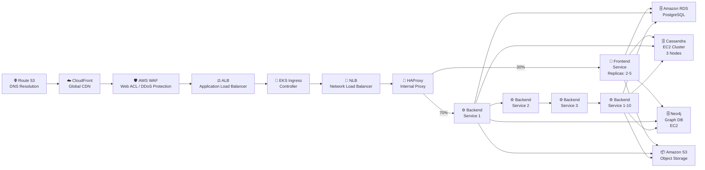
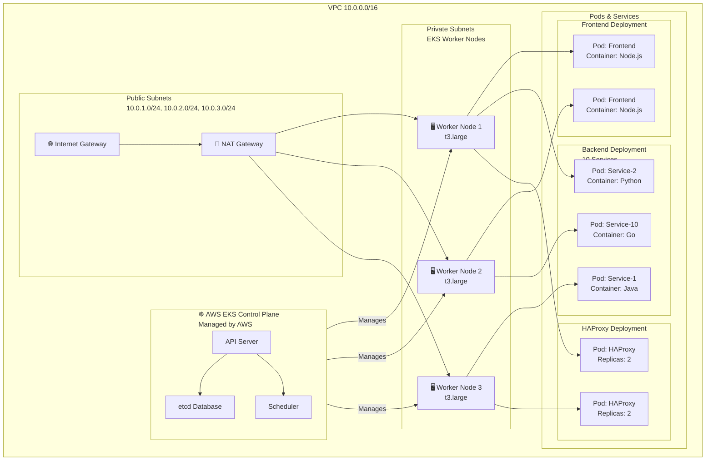
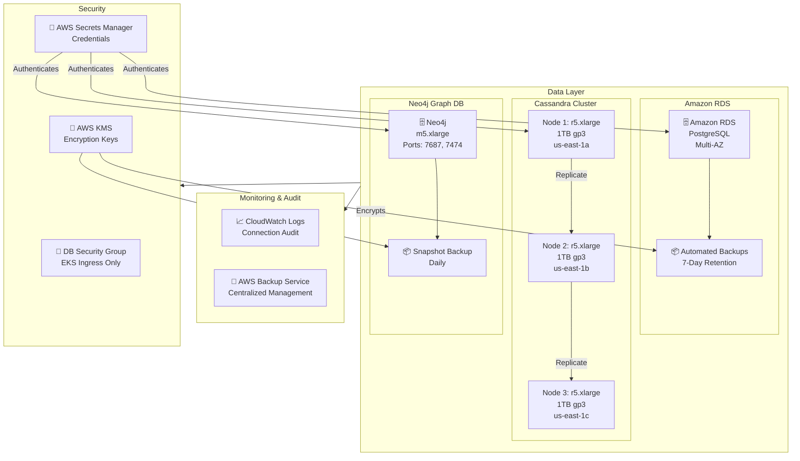
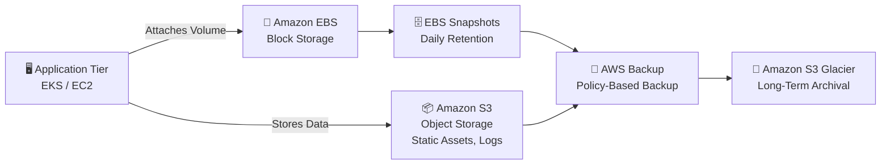

# Architecture Diagrams

## Overview

This document captures the primary AWS architecture diagrams for the platform.
It uses Mermaid notation for visual design and reflects AWS components such as Route 53, CloudFront, WAF, ALB, EKS, RDS, S3, ECR, and AWS Backup.

## Contents

- [Overview](#overview)
- [Request Flow Diagram](#1-request-flow-diagram)
- [EKS Cluster Architecture](#2-eks-cluster-architecture)
- [Data Layer Architecture](#3-data-layer-architecture)
- [CI/CD Pipeline Flow](#4-cicd-pipeline-flow)
- [Storage & Backup Architecture](#5-storage--backup-architecture)
- [Diagram Conventions](#diagram-conventions)

---

## 1. Request Flow Diagram

This diagram shows the external request path from the client through AWS edge services, network security, load balancing, and into the Kubernetes application tier.

This flow emphasizes AWS edge services, secure ingress, and service-to-data connectivity across frontend and backend tiers.

---

## 2. EKS Cluster Architecture

This view describes the AWS VPC, subnet layout, EKS managed control plane, worker node groups, and pod placement.

The cluster diagram highlights AWS managed EKS control plane separation, private worker node groups, and public subnet egress.

---

## 3. Data Layer Architecture

This section illustrates AWS data infrastructure, security boundaries, and backup flows for the stateful data tier.

This data layer emphasizes AWS-managed relational storage, secrets management, encryption, and multi-node replication.

---

## 4. CI/CD Pipeline Flow

The pipeline diagram outlines code commit through build, test, containerization, deployment, and verification with AWS container registry integration.

```mermaid
graph LR
    Git["📝 Git Repository<br/>GitHub/GitLab<br/>Webhook Trigger"]
    
    Jenkins["🚀 Jenkins Master<br/>Build Orchestration"]
    
    Build["🔨 Build Stage<br/>Maven / npm<br/>Compile & Test"]
    
    Test["🧪 Test Stage<br/>Unit Tests<br/>SonarQube<br/>SAST"]
    
    Container["📦 Docker Build<br/>Image Scan<br/>Tag Image"]
    
    ECR["🐳 Amazon ECR<br/>Container Registry"]
    
    Deploy["📤 Deploy Stage<br/>Helm Chart<br/>kubectl Apply"]
    
    EKS["☸️ Amazon EKS<br/>Kubernetes Cluster"]
    
    Verify["✅ Verification<br/>Smoke Tests<br/>Health Check"]
    
    Notify["📢 Notification<br/>Slack / Email<br/>Success / Failure"]
    
    Git -->|Webhook| Jenkins
    Jenkins --> Build
    Build --> Test
    Test --> Container
    Container --> ECR
    ECR --> Deploy
    Deploy --> EKS
    EKS --> Verify
    Verify --> Notify
```

The CI/CD flow supports continuous delivery with a verification step before notification and deployment to Amazon EKS.

---

## 5. Storage & Backup Architecture

This diagram shows how AWS storage and backup services integrate with the application and data tiers to ensure recovery and retention.

This section standardizes the storage layer with Amazon S3, Amazon EBS, AWS Backup, and Glacier archival.

---

## Diagram Conventions

- All diagrams use Mermaid code blocks for consistent rendering.
- Headings use a numbered structure for easy navigation.
- AWS components are labeled with service names and deployment intent.
- Each section includes a summary to explain the diagram purpose.
