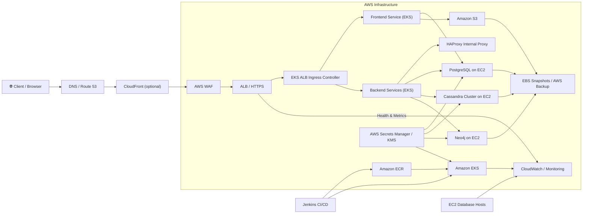

# Infrastructure Design

## Overview
This document provides a structured infrastructure design for the AWS-based application platform in this repository. It includes both a high-level architecture view and a low-level design covering network, compute, data, storage, CI/CD, and monitoring details.

---

## High-Level Design

### 1. Design Goals
- Provide a scalable, highly available application platform.
- Secure external traffic through edge protection and private service communication.
- Separate application, data, and deployment tiers for manageability.
- Use AWS managed services where appropriate while preserving control for stateful workloads.
- Support automated delivery and observability for production readiness.

### 2. Logical Architecture
The infrastructure is organized into the following logical tiers:

- **Edge and Security Layer**
  - AWS WAF for web application firewall protection and DDoS mitigation.
  - Application Load Balancer (ALB) for SSL/TLS termination and HTTP traffic routing.

- **Application Layer**
  - Amazon EKS for container orchestration and microservice hosting.
  - Kubernetes Ingress with AWS ALB Ingress Controller to expose services.
  - Internal HAProxy for service-level load balancing and traffic distribution.

- **Data Layer**
  - PostgreSQL on EC2 for relational storage.
  - Cassandra cluster on EC2 for NoSQL/time-series workloads.
  - Neo4j on EC2 for graph data and relationship queries.

- **Storage and Backup Layer**
  - Amazon S3 for object storage: logs, media, artifacts, backups.
  - Amazon EBS for EC2 volume storage and application persistence.
  - AWS Backup and EBS snapshots for recovery and retention.

- **CI/CD and Registry Layer**
  - Jenkins orchestrates build, test, container build, and deploy pipelines.
  - Amazon ECR stores container images and supports image scanning.

- **Observability Layer**
  - Amazon CloudWatch for metrics, logs, and alarms.
  - AWS X-Ray, CloudTrail, and optional Prometheus/Grafana for advanced monitoring.

### 3. Traffic Flow Summary
1. Client traffic enters via DNS and optional CloudFront CDN.
2. Traffic is inspected and filtered by AWS WAF.
3. Valid traffic is routed through an ALB into the EKS ingress.
4. Ingress traffic is load-balanced to frontend and backend services.
5. Services access private data stores and object storage through secure VPC paths.
6. Build and deployment updates are delivered via Jenkins to EKS.

---

## Low-Level Design

### 1. Networking and Security
- **VPC**
  - Dedicated VPC with separate public and private subnets.
  - Public subnets host ingress endpoints, NAT gateways, and possibly bastion hosts.
  - Private subnets host EKS worker nodes and stateful EC2 database instances.

- **Subnet Layout**
  - At least three AZs for public and private subnets to improve availability.
  - NAT Gateway(s) in public subnet(s) enable private nodes to access the internet.

- **Security Groups**
  - ALB security group allows inbound HTTPS from the internet.
  - EKS node/pod security groups allow inbound traffic from ALB and internal services only.
  - Database security groups restrict inbound access to the EKS cluster and chosen admin CIDRs.

- **IAM and Secrets**
  - IAM roles for EKS nodes and service accounts provide least-privilege access to AWS resources.
  - AWS Secrets Manager stores database credentials and API keys.
  - KMS is used for encryption of S3 buckets, EBS volumes, and secrets.

- **Edge Protection**
  - AWS WAF rules for SQL injection, XSS, bot mitigation, and rate limiting.
  - Optional AWS Shield Standard for DDoS protection.

### 2. Compute and Application Hosting
- **Amazon EKS**
  - Managed control plane with Kubernetes API server and etcd.
  - Worker nodes sized for workload: `t3.large` for dev, `m5.xlarge` for production.
  - Node groups with auto-scaling enabled to handle variable load.

- **Pod Design**
  - Frontend pods: Node.js or React container, 2-5 replicas, health checks on `/health` and `/ready`.
  - Backend pods: multiple microservices, 2-5 replicas each, resource requests and limits defined.
  - HAProxy pods: 2+ replicas, internal load balancing and connection handling.

- **Ingress and Service Routing**
  - AWS ALB Ingress Controller routes external requests into Kubernetes.
  - Internal services communicate via Kubernetes Services or via HAProxy.
  - Use readiness probes to avoid traffic to unready pods.

- **Fault Tolerance**
  - Replica sets and HPA ensure service continuity under load.
  - Pod anti-affinity or AZ spread can prevent single point failures.

### 3. Data Layer
- **PostgreSQL**
  - Deployed on EC2 in private subnet.
  - Instance type `r5.2xlarge` recommended for production.
  - EBS gp3 storage with provisioned IOPS as needed.
  - Backups via EBS snapshots and scheduled daily snapshots.
  - Optional use of RDS Multi-AZ for higher availability if migration to managed DB is feasible.

- **Cassandra**
  - Minimum 3-node cluster across AZs for replication and availability.
  - Instance type `r5.xlarge` with 1TB gp3 volumes.
  - Use replication factor 3 and quorum consistency for writes and reads.
  - Internal ports restricted to EKS and cluster peer traffic only.

- **Neo4j**
  - Dedicated EC2 instance in private subnet.
  - Ports 7687 (Bolt) and 7474 (HTTP) exposed only to internal services.
  - Daily backups and KMS encryption for snapshots.

### 4. Storage and Backup
- **Amazon S3**
  - Buckets for logs, media, backups, and artifacts.
  - Versioning enabled.
  - Server-side encryption with KMS.
  - Lifecycle policies to move older data to Glacier.
  - S3 Block Public Access enabled on all buckets.

- **EBS and Snapshots**
  - EBS volumes attached to EC2 databases and application nodes as needed.
  - Regular snapshots and retention policy managed through AWS Backup or automation.

- **AWS Backup**
  - Central backup policy for RDS/EBS/S3.
  - Retention aligned with business recovery objectives.
  - Optional cross-region replication for disaster recovery.

### 5. CI/CD and Container Registry
- **Jenkins Pipeline**
  - Source stage pulls changes from GitHub/GitLab using webhooks.
  - Build stage compiles code and runs tests (Maven/Gradle/npm as appropriate).
  - Security and quality gates can include SonarQube scanning.
  - Docker build stage publishes images to ECR.
  - Deploy stage uses Helm or kubectl to update EKS workloads.
  - Verification stage runs smoke tests and publishes deployment results.

- **Amazon ECR**
  - Image registry for frontend and backend containers.
  - Lifecycle policies retain recent tags only.
  - ECR scanning enabled to detect vulnerabilities.
  - EKS service accounts access ECR through IAM roles.

### 6. Monitoring, Logging, and Alerts
- **CloudWatch**
  - Collect metrics from EKS, EC2, ALB, and database hosts.
  - Centralized logs for application containers and system components.
  - Alarms for CPU, memory, request errors, and unhealthy pods.

- **Tracing and Auditing**
  - AWS X-Ray for distributed tracing across services.
  - CloudTrail for AWS API auditing.

- **Optional Observability Stack**
  - Prometheus for custom metrics scraping.
  - Grafana for dashboards.
  - ELK stack for centralized log search and analytics.

### 7. Operational Considerations
- **Deployment Strategy**
  - Use blue/green or canary deployments where possible to minimize outage risk.
  - Maintain separate environments for dev, staging, and production.

- **Security and Compliance**
  - Enforce least privilege with IAM roles and network ACLs.
  - Regularly rotate secrets and keys.
  - Apply AWS Config rules and guardrails for compliance.

- **Disaster Recovery**
  - Backup and restore procedures for data stores.
  - Multi-AZ or cross-region backups for critical data.
  - Run periodic recovery drills.

---

## Infrastructure Diagram

---

## Summary
This design frames the current AWS architecture into two levels:
- The high-level design explains the main functional tiers, traffic flow, and platform intent.
- The low-level design provides concrete implementation details for networking, compute, data, storage, CI/CD, and observability.

Use this document as the basis for infrastructure planning, cloud architecture reviews, or handoff to implementation teams.
